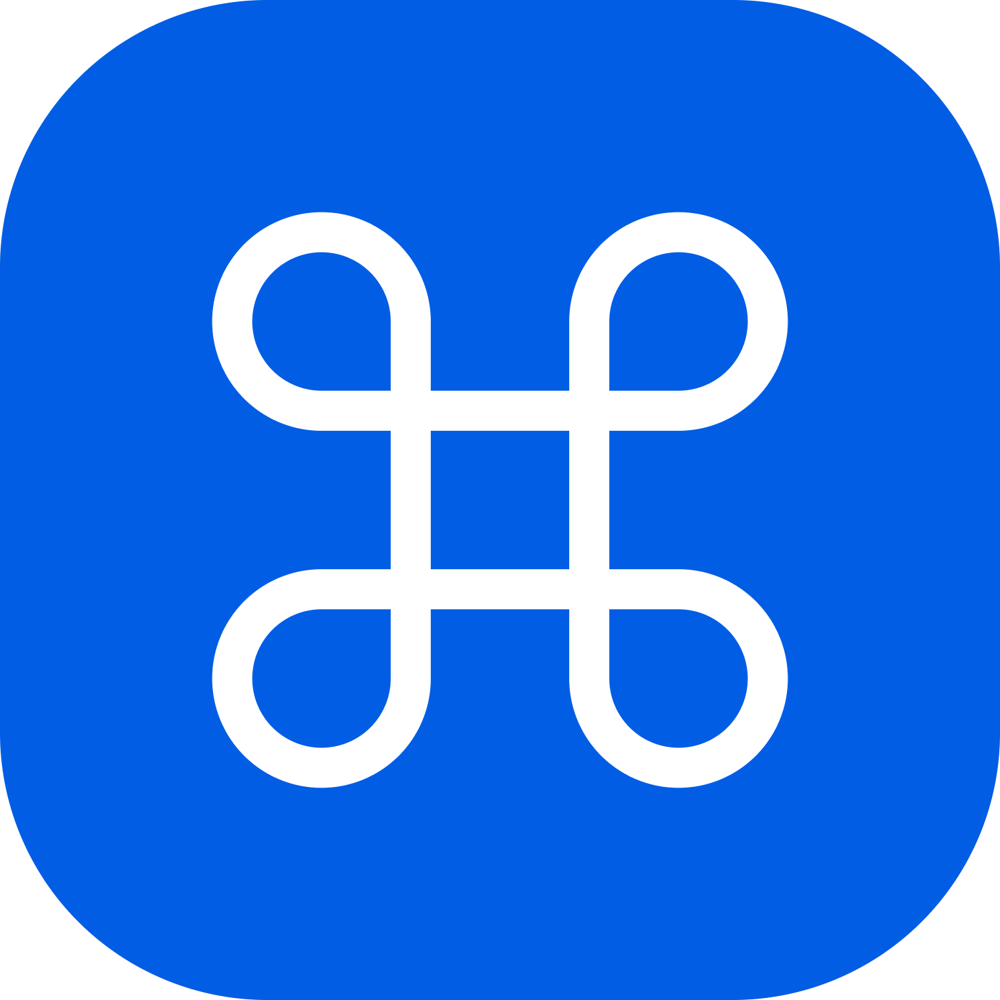
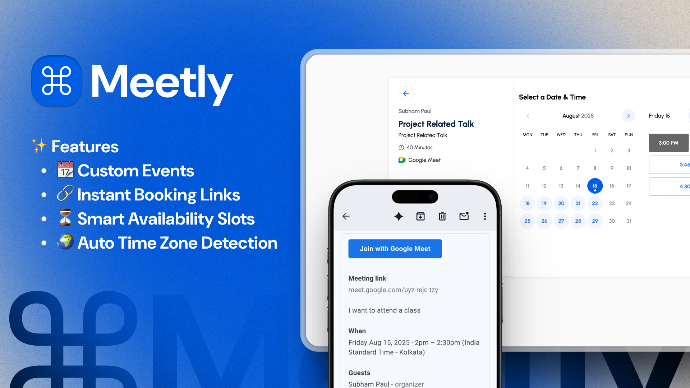

# ⌘ Meetly

<div align="center">

  
  <h3>✨ Beautiful Meeting Scheduling Made Simple</h3>
  
  
  
  
  
  
  
  <br/>
  
  
  
  
</div>

<p align="center">
  <strong>A modern, intuitive frontend for the Meetly platform</strong><br>
  Schedule meetings effortlessly with a beautiful, responsive interface built with React & TypeScript
</p>



## 📋 Table of Contents

- [✨ Features](#-features)
- [🎨 Design System](#-design-system)
- [🛠️ Tech Stack](#️-tech-stack)
- [📁 Project Structure](#-project-structure)
- [🚀 Quick Start](#-quick-start)
- [🔧 Configuration](#-configuration)
- [📱 Pages & Routes](#-pages--routes)
- [🎯 Components](#-components)
- [🔗 API Integration](#-api-integration)
- [🌙 Theme & Styling](#-theme--styling)
- [📝 Scripts](#-scripts)
- [🧪 Development](#-development)
- [🌐 Deployment](#-deployment)

---

## ✨ Features

### 🎯 **Core Functionality**

- 📅 **Meeting Scheduling** - Intuitive booking interface
- ⏰ **Availability Management** - Set your working hours and breaks
- 📊 **Event Types** - Create different meeting types with custom settings
- 🔗 **Integration Hub** - Connect Google Calendar, Zoom, and more
- 📱 **Responsive Design** - Perfect on desktop, tablet, and mobile
- 🌙 **Dark/Light Mode** - Beautiful themes for any preference

### 🔐 **Authentication & Security**

- 🔐 **Secure Login** - JWT-based authentication
- 🌐 **Google OAuth** - Quick sign-in with Google
- 👤 **User Profiles** - Manage your account and preferences
- 🔒 **Protected Routes** - Secure access control

### 🎨 **User Experience**

- ⚡ **Lightning Fast** - Powered by Vite for instant updates
- 🎭 **Modern UI** - Clean, professional interface
- 📱 **Mobile First** - Optimized for all screen sizes
- ♿ **Accessible** - Built with accessibility in mind
- 🎯 **Intuitive** - Easy-to-use interface for all users

### 🔧 **Developer Experience**

- 🏗️ **TypeScript** - Full type safety
- 🧩 **Component Library** - Reusable UI components
- 📊 **State Management** - Zustand for clean state handling
- 🔄 **Data Fetching** - React Query for efficient API calls
- 🎨 **Tailwind CSS** - Utility-first styling

---

## 🎨 Design System

### Typography

- **Font Family**: Inter (Clean, modern sans-serif)
- **Headings**: Bold, clear hierarchy
- **Body**: Readable, optimized for screens
- **Code**: Monospace for technical content

### Components

- **Buttons**: Multiple variants (primary, secondary, outline)
- **Forms**: Accessible, validated inputs
- **Cards**: Clean, modern containers
- **Modals**: Smooth, accessible dialogs
- **Navigation**: Intuitive, responsive menus

---

## 🛠️ Tech Stack

| Category             | Technology            | Purpose                         |
| -------------------- | --------------------- | ------------------------------- |
| **Framework**        | React 19              | Modern UI library               |
| **Language**         | TypeScript            | Type-safe development           |
| **Build Tool**       | Vite 6                | Fast development & building     |
| **Styling**          | Tailwind CSS 4        | Utility-first CSS framework     |
| **UI Components**    | Radix UI              | Accessible, unstyled components |
| **State Management** | Zustand               | Lightweight state management    |
| **Data Fetching**    | React Query + SWR     | Server state management         |
| **Routing**          | React Router 7        | Client-side routing             |
| **Forms**            | React Hook Form + Zod | Form handling & validation      |
| **HTTP Client**      | Axios                 | API communication               |
| **Date Handling**    | date-fns              | Date manipulation               |
| **Icons**            | Lucide React          | Beautiful, consistent icons     |
| **Notifications**    | Sonner                | Toast notifications             |
| **Theme**            | next-themes           | Dark/light mode support         |

---

## 📁 Project Structure

```
frontend/
├── 📄 package.json             # Dependencies and scripts
├── 📄 vite.config.ts           # Vite configuration
├── 📄 tailwind.config.js       # Tailwind CSS config
├── 📄 tsconfig.json            # TypeScript configuration
├── 📁 public/                  # Static assets
│   └── Meetly.svg              # App icon
└── 📁 src/
    ├── 📄 App.tsx              # Main app component
    ├── 📄 main.tsx             # Application entry point
    ├── 📄 index.css            # Global styles
    ├── 📁 assets/              # Images, icons, SVGs
    ├── 📁 components/          # Reusable UI components
    │   ├── 📁 ui/              # Base UI components
    │   ├── 📁 calendar/        # Calendar components
    │   └── 📁 loader/          # Loading components
    ├── 📁 pages/               # Page components
    │   ├── 📁 auth/            # Authentication pages
    │   ├── 📁 availability/    # Availability management
    │   ├── 📁 event_type/      # Event type management
    │   ├── 📁 integrations/    # Integration settings
    │   ├── 📁 meeting/         # Meeting pages
    │   └── 📁 external_page/   # Public booking pages
    ├── 📁 layout/              # Layout components
    ├── 📁 routes/              # Route definitions
    ├── 📁 hooks/               # Custom React hooks
    ├── 📁 store/               # State management
    ├── 📁 lib/                 # Utilities and configs
    ├── 📁 context/             # React contexts
    └── 📁 types/               # TypeScript type definitions
```

---

## 🚀 Quick Start

### Prerequisites

- **Node.js** 18+ and npm
- **Backend API** running (see backend README)

### Installation

1. **Navigate to frontend directory**

   ```bash
   cd frontend
   ```

2. **Install dependencies**

   ```bash
   npm install
   ```

3. **Set up environment variables**

   ```bash
   cp .env.example .env.local
   # Edit .env.local with your configuration
   ```

4. **Start development server**

   ```bash
   npm run dev
   ```

5. **Open in browser**
   ```
   http://localhost:5173
   ```

🎉 **You're ready to go!**

---

## 🔧 Configuration

### Environment Variables

Create a `.env.local` file in the frontend root:

```env
# API Configuration
VITE_APP_ORIGIN="http://localhost:5173"
VITE_API_BASE_URL=http://localhost:8000/api
```

### Vite Configuration

```typescript
// vite.config.ts
export default defineConfig({
  plugins: [react(), tailwindcss()],
  server: {
    port: 5173,
    host: true,
  },
  build: {
    outDir: "dist",
    sourcemap: true,
  },
});
```

---

## 📱 Pages & Routes

### Public Routes

- **`/`** - Landing page
- **`/auth/login`** - User login
- **`/auth/register`** - User registration
- **`/book/:username/:eventType`** - Public booking page

### Protected Routes

- **`/app/dashboard`** - User dashboard
- **`/app/availability`** - Availability settings
- **`/app/event-types`** - Event type management
- **`/app/meetings`** - Meeting history
- **`/app/integrations`** - Third-party integrations
- **`/app/settings`** - Account settings

### Route Guards

```tsx
// Protected route wrapper
<ProtectedRoute>
  <Dashboard />
</ProtectedRoute>
```

---

## 🎯 Components

### UI Components (`/components/ui/`)

- **Button** - Multiple variants and sizes
- **Input** - Form inputs with validation
- **Card** - Content containers
- **Dialog** - Modal dialogs
- **Calendar** - Date picker component
- **Avatar** - User profile images
- **Badge** - Status indicators
- **Tabs** - Tabbed interfaces

### Feature Components

- **AppSidebar** - Main navigation
- **Header** - Top navigation bar
- **TimeSelector** - Time slot picker
- **HourButton** - Time selection buttons
- **PageTitle** - Consistent page headers
- **ErrorAlert** - Error handling

### Example Usage

```tsx
import { Button } from "@/components/ui/button";
import { Card } from "@/components/ui/card";

function MyComponent() {
  return (
    <Card>
      <Button variant="primary" size="lg">
        Schedule Meeting
      </Button>
    </Card>
  );
}
```

---

## 🔗 API Integration

### HTTP Client Setup

```typescript
// lib/axios-client.ts
const apiClient = axios.create({
  baseURL: import.meta.env.VITE_API_BASE_URL,
  timeout: 10000,
  headers: {
    "Content-Type": "application/json",
  },
});
```

### Data Fetching with React Query

```typescript
// hooks/use-events.ts
export function useEvents() {
  return useQuery({
    queryKey: ["events"],
    queryFn: () => apiClient.get("/events").then((res) => res.data),
  });
}
```

### State Management with Zustand

```typescript
// store/auth-store.ts
interface AuthState {
  user: User | null;
  token: string | null;
  login: (token: string, user: User) => void;
  logout: () => void;
}

export const useAuthStore = create<AuthState>((set) => ({
  user: null,
  token: null,
  login: (token, user) => set({ token, user }),
  logout: () => set({ token: null, user: null }),
}));
```

---

## 🌙 Theme & Styling

### Dark/Light Mode

```tsx
import { useTheme } from "next-themes";

function ThemeToggle() {
  const { theme, setTheme } = useTheme();

  return (
    <Button onClick={() => setTheme(theme === "dark" ? "light" : "dark")}>
      Toggle Theme
    </Button>
  );
}
```

### Custom Tailwind Classes

```css
/* Custom utilities */
.gradient-bg {
  @apply bg-gradient-to-r from-blue-500 to-purple-600;
}

.glass-effect {
  @apply backdrop-blur-md bg-white/10 border border-white/20;
}
```

---

## 📝 Scripts

| Script               | Description              |
| -------------------- | ------------------------ |
| `npm run dev`        | Start development server |
| `npm run build`      | Build for production     |
| `npm run preview`    | Preview production build |
| `npm run lint`       | Run ESLint               |
| `npm run type-check` | Check TypeScript types   |

---

## 🧪 Development

### Code Style

- **ESLint** - Code linting
- **Prettier** - Code formatting
- **TypeScript** - Type checking
- **Conventional Commits** - Commit message format

### Best Practices

1. **Component Organization** - One component per file
2. **Custom Hooks** - Reusable logic extraction
3. **Type Safety** - Comprehensive TypeScript usage
4. **Performance** - React.memo and useMemo optimization
5. **Accessibility** - ARIA labels and keyboard navigation

### Development Workflow

```bash
# Start development
npm run dev

# Type check
npm run type-check

# Lint code
npm run lint

# Build for production
npm run build
```

---

## 🌐 Deployment

### Build for Production

```bash
npm run build
```

### Deploy to Vercel

```bash
npm install -g vercel
vercel
```

### Deploy to Netlify

```bash
npm run build
# Upload dist/ folder to Netlify
```

---

<div align="center">
  
  <h3>🚀 Ready to Schedule Your Success?</h3>
  <p>Made with ❤️ for seamless meeting scheduling</p>
  
  <p>
    <a href="#-table-of-contents">⬆️ Back to top</a>
  </p>
</div>
